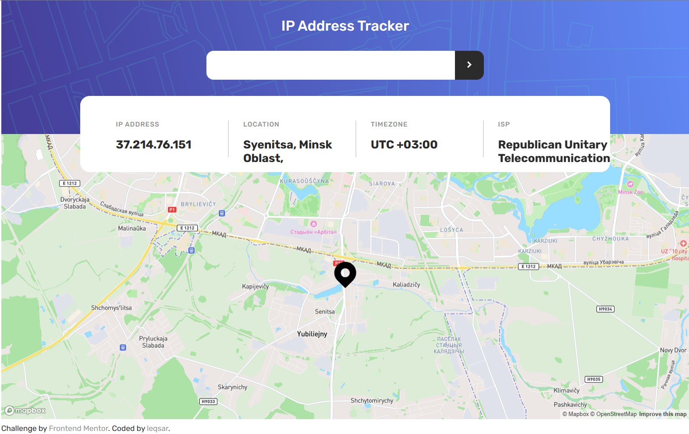

# Frontend Mentor - IP address tracker solution

This is a solution to the [IP address tracker challenge on Frontend Mentor](https://www.frontendmentor.io/challenges/ip-address-tracker-I8-0yYAH0). Frontend Mentor challenges help you improve your coding skills by building realistic projects.

## Table of contents

- [Overview](#overview)
  - [The challenge](#the-challenge)
  - [Screenshot](#screenshot)
  - [Links](#links)
- [My process](#my-process)
  - [Built with](#built-with)
  - [What I learned](#what-i-learned)
  - [Continued development](#continued-development)
  - [Useful resources](#useful-resources)
- [Author](#author)

## Overview

### The challenge

Users should be able to:

- View the optimal layout for each page depending on their device's screen size
- See hover states for all interactive elements on the page
- See their own IP address on the map on the initial page load
- Search for any IP addresses or domains and see the key information and location

### Screenshot

### Links

- Live Site URL: [https://leqsar.github.io/ip-tracker/](https://leqsar.github.io/ip-tracker/)

## My process

### Estimated time

6 hours

### Actual time

4 hours

### Built with

- Semantic HTML5 markup
- CSS animation
- Flexbox
- API requests (fetch)
- [Vue](https://vuejs.org/) - Vue framework
- [SASS](https://sass-lang.com/)
- [Vite](https://vitejs-dev.translate.goog/?_x_tr_sl=en&_x_tr_tl=ru&_x_tr_hl=ru&_x_tr_pto=sc)

### What I learned

- I learned about VUE lifecycle and some VUE lifecycle's hooks
- I finally tried basics CSS animations
- I gained some more experience with map APIs

### Continued development

In future projects I want to focus on some smooth CSS and GSAP+VUE animations because I am not completely comfortable with them right now. Also I am looking forward to create something more complicated on VUE (for example, mini games).

### Useful resources

To build this little web app I used following APIs:

- [IP Geolocation API by IPify](https://geo.ipify.org/) - This helped me with getting location from IP
- [Mapbox](https://www.mapbox.com/) - This API helped me with rendering the map.
- [Mapbox VUE 3](https://vue-mapbox-gl.studiometa.dev/) - This small library of VUE 3 components for mapbox helped me a lot since Mapbox doesn't have any solutions for VUE.

## Author

- Website - [Sasha](https://www.instagram.com/lek_an_arteg/)
- Frontend Mentor - [@leqsar](https://www.frontendmentor.io/profile/yourusername)
